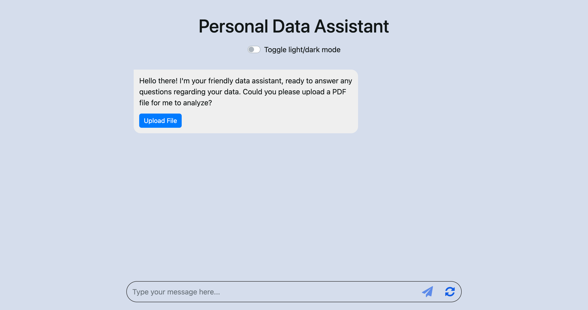

# Generative AI Application – Personal Data Chatbot

Demo App: 

## Overview

In this project, I created a chatbot for my own pdf file using Flask, a popular web framework, and LangChain, another popular framework for working with large language models (LLMs). The chatbot not just interact with users through text but also comprehend and answer questions related to the content of a specific document.

At the end of this project, I gained a deeper understanding of chatbots, web application development using Flask and Python, and the use of LangChain framework in interpreting and responding to a wide array of user inputs. And most important, I built a comprehensive and impressive chatbot application!

## Instructors / Author(s)
Sina Nazeri
Talha Siddiqui

© IBM Corporation. All rights reserved.